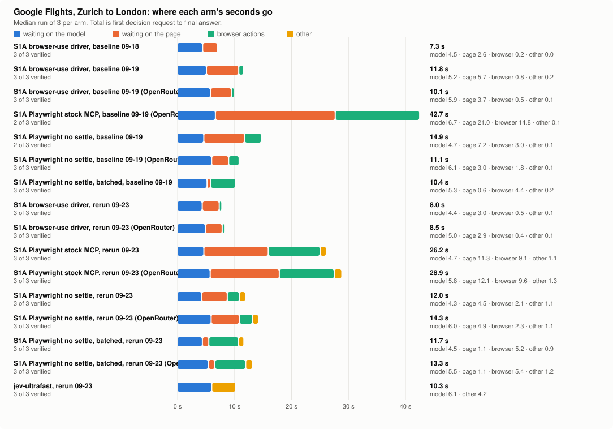

# Benchmarks: Jev against the chat model in the same agent

Every number here compares a System 1 decision model against a chat model in the same agent, on the same tools and
the same seeds. The model is the only difference between the two columns.

## Six agents, one episode each

One episode per agent on one seed, both sides on the wall clock. The replays are under `assets/demos/` and in the
README.

<!-- placeholder: name the chat model behind the "chat model" columns (the MODEL_NAME of these runs). -->

| scenario | Jev | chat model | speedup | Jev cost | chat model cost | more expensive | score, Jev / chat model |
|---|---|---|---|---|---|---|---|
| Ticket router, 30 tickets | 12.7 s | 65.3 s | 5.14× | $0.000764 | $0.014800 | 19.4× | 30 / 30 |
| Desktop, Windows Calculator | 17.2 s | 30.1 s | 1.75× | $0.000447 | $0.003002 | 6.7× | 1 / 1 |
| ALFWorld | 7.4 s | 25.7 s | 3.47× | $0.000221 | $0.002800\* | 12.7× | 1 / 1 |
| 2048, 20 moves | 27.1 s | 68.5 s | 2.53× | $0.000447 | $0.006139 | 13.7× | 64 / 80 |
| Millionaire | 15.3 s | 21.6 s | 1.41× | $0.000168 | $0.000892 | 5.3× | $1,000 / $0 |
| Blackjack | 2.3 s | 14.7 s | 6.39× | $0.000021 | $0.000531 | 25.3× | 1 / 1 |

\* Estimated; the chat-model run recorded no cost. A score of 1 is a won hand, a solved household task or a window
that shows the expected result. The browser row is in the next section.

## Browser use: Allrecipes

The `allrecipes` agent runs the first Allrecipes task of the [WebVoyager](https://github.com/MinorJerry/WebVoyager)
task set verbatim (`Allrecipes--0` in `data/WebVoyager_data.jsonl`; [He et al., 2024](https://arxiv.org/abs/2401.13919);
Apache License 2.0, attribution in `NOTICE`): a vegetarian lasagna with more than 100 reviews, a rating of at least
4.5 stars, suitable for 6 people, answered in text. Both models ran headed on
2026-09-22 (the site answers a headless Chromium with a bot wall) on the Playwright MCP without its settle sleeps,
with a frame after every browser call from the run's own MCP session: `scripts/browser_showcase.sh allrecipes 2`.
The chat model on both sides is Claude Fable 5.1 through OpenRouter, at $10 per million input tokens, $50 per
million output tokens and $0.25 per million cached input tokens; Jev's decisions go to TypeSafe at $0.042 per
million input tokens. The Jev run pays the chat model for one typed value, the search text, and for the answer.

| run | model | wall s | decisions | chat calls | chat tokens in / cached / out | Jev tokens | cost | answer |
|---|---|---|---|---|---|---|---|---|
| 0 | jev | 35.7 | 5 | 4 | 7,946 / 1,210 / 454 | 23,654 | $0.0914 | Easy Vegetarian Spinach Lasagna: 4.6 stars, 117 ratings, serves 6 |
| 1 | jev | 40.4 | 4 | 4 | 7,335 / 0 / 440 | 18,785 | $0.0961 | the same recipe |
| 2 | jev | 25.4 | 4 | 4 | 7,335 / 7,295 / 365 | 18,785 | $0.0213 | the same recipe |
| 0 | llm | 116.9 | 11 | 12 | 238,211 / 123,989 / 4,811 | 0 | $1.4138 | the same recipe; the harness's own verdict on the run was blocked |
| 1 | llm | 143.8 | 9 | 10 | 200,547 / 91,155 / 5,355 | 0 | $1.3845 | the same recipe |
| 2 | llm | 138.7 | 10 | 12 | 230,599 / 115,042 / 6,200 | 0 | $1.4943 | the same recipe |

Every answer meets the task's three conditions, checked by hand on the recipe page: 4.6 stars, 117 ratings (85 of
them written reviews; the WebVoyager judge of the September 19 batch accepted the ratings count as reviews),
6 servings. The README row and the replay are Jev's run 0 against the chat model's run 2, the median run of each
model by wall clock; the chat model's cost is 16.4 times Jev's. The records of those two runs are under `results/allrecipes/`.

Two more pairs ran the same afternoon without records in that folder. The first, before the probe dropped escaped
markup from control labels: Jev answered in 31.9 s of process time for $0.102 with the same recipe, after two clicks
on a card whose label was an image tag; the chat model missed the serving count: 120.8 s and $1.212 for Vegetarian
Four Cheese Lasagna, 4.6 stars, 243 ratings, 8 servings. The second, whose records a later run of the script
overwrote: Jev 40.3 s, 5 decisions and $0.096; the chat model 104.9 s, 8 decisions and $1.096; both the spinach
lasagna.

`wall s` is the task's own clock, written to `answer.json`: the browser's start, the navigation, every decision and
the final answer. Of the Jev run's cost, the decisions themselves are a tenth of a cent; the rest is the chat
model's typed value and answer. Jev's run 2 cost a fifth of run 1 because it read 7,295 of its 7,335 prompt tokens
from the cache. The frames add one screenshot per browser call on both sides. Each run begins with a
chat-model call by the harness that probes the model's image support. OpenRouter refuses that call for this model and
the harness continues without it. Both sides pay it.


## A longer game

Over 150 moves of 2048 the cost gap widens with the transcript. Seed 0: Jev scored 1,104 in 244 s for $0.003; the
chat model scored 1,188 in 363 s for $0.31.


The same showcase on ALFWorld, Blackjack and Millionaire is under `results/<eval>/showcase/replay.gif`, written by
`scripts/showcase.sh`.

## The injection guard rail

The rail scores 20 of 20 on its labelled set at a median of 464 ms (`s1a run injection_guard`).

## Series

The protocol in `evals/README.md` quotes nothing under ten episodes and asks for 500 Blackjack hands. The series of
2026-09-19, from job folders on the author's machine; the chat model of the `llm` rows is not recorded in them:

| eval | model | N | score, 95 % CI | s per episode | steps | $ per episode |
|---|---|---|---|---|---|---|
| Blackjack | jev | 100 | -0.06 [-0.25, 0.13] | 0.6 | 1.5 | 0.0000 |
| Blackjack | llm | 100 | -0.06 [-0.25, 0.13] | 3.0 | 1.5 | 0.0006 |
| Blackjack | basic strategy | 100 | -0.06 [-0.25, 0.13] | 0.0 | 1.5 | 0 |
| ALFWorld text | jev | 12 | 0.75 [0.50, 1.00] | 3.4 | 20.3 | 0.0015 |
| ALFWorld text | llm | 12 | 0.917 [0.75, 1.00] | 9.2 | 12.6 | 0.0247 |
| ALFWorld text | oracle plan | 12 | 0.917 [0.75, 1.00] | 0.4 | 19.3 | 0 |
| 2048 | jev | 5 | 1115 [924, 1238] | 168.9 | 146.6 | 0.0032 |

On Blackjack the three models play the identical basic strategy over 100 hands. Jev takes a fifth of the chat
model's time per hand. On ALFWorld the chat model wins two more games of twelve. It spends 16 times the dollars.
`uv run python -m evals.table evals/results` prints this table for any run. `laya` and `cua` have no
numbers yet.

## Google Flights: four drivers on one clock

Goal for every arm: open Google Flights, find one-way flights from Zurich to London on September 20, 2026, one adult, economy, stop when matching flight options are visible. The clock runs from the first decision request to the final `DONE`. Every run uses the same Chrome (`--remote-debugging-port=9222`, scratch profile), the same decisions backend (`typesafe/jev-1.13` through OpenRouter's `/api/alpha/decisions`), and the same chat model for typed values (`google/gemini-2.5-flash`). A run counts as verified when the results page shows flight options for that route and date. Measured 2026-09-19 on one MacBook Air, the twelve runs back to back.

### Arms

- **A, jev-ultrafast**: browser-use's own agent and loop, Chrome through browser-harness. Reference.
- **B, S1A on the browser-use driver**: this repo's policy inside openJiuwen's browser subagent, on the agtai fork at tag `jj-bu-baseline` (agtai/agent-core PR #6), where the driver is a browser-use sidecar over CDP.
- **C, S1A on the stock Playwright runtime**: the same policy through the decision-policy slot ([ThinkFlowLab/agent-core#1](https://github.com/ThinkFlowLab/agent-core/pull/1)), openJiuwen's Playwright runtime, official `@playwright/mcp@0.0.78`.
- **C', S1A on Playwright without the settle sleeps**: arm C with one change in the MCP server: `waitForCompletion` no longer sleeps 500 ms before and after waiting for in-flight requests. `scripts/pw_mcp_nosettle.sh` prepares that copy; it is a patched npm package.
- **C'', S1A on Playwright, no settle sleeps, batched actions**: arm C' with `--batch on`: each step is one `browser_run_code_unsafe` call that performs the action and returns the next probe, one transport round trip per step where C' uses two. The runtime's target validation is skipped on that path; the batched code re-stamps and re-finds the target by role and label when a re-render dropped the stamp.

Per run, S1A arms record the profiler JSON (`s1a run flights --model jev --batch on --profile-out run.json`); arm A records jev-ultrafast's `state.json`. `scripts/summarize_runs.py` prints the table from those files. The S1A records live under `docs/results/flights/`. The arm A records stay out of the tree because each holds a page screenshot. The shipped `flights` agent computes its date as the first Sunday at least 28 days after the run day; the runs below used September 20, 2026. The records' `visible_flights` and screenshots show prices in yen because the runs were made from Japan; Google picks the currency from the run's location.

### Results

| run | window s | decisions | median ms | decision s | probe s | tool s | value wait s | verified |
|---|---|---|---|---|---|---|---|---|
| A-1 | 13.8 | 21 (11 not executed) | 462 | 10.4 | n/a | n/a | n/a | yes |
| A-2 | 13.1 | 19 (9 not executed) | 496 | 10.1 | n/a | n/a | n/a | yes |
| A-3 | 12.6 | 18 (8 not executed) | 470 | 9.3 | n/a | n/a | n/a | yes |
| B-1 | 10.1 | 12 | 455 | 5.9 | 3.7 | 0.5 | 0.0 | yes |
| B-2 | 11.2 | 12 | 510 | 6.3 | 4.3 | 0.5 | 0.0 | yes |
| B-3 | 10.1 | 12 | 438 | 5.4 | 4.1 | 0.5 | 0.0 | yes |
| C-1 | 30.0 | 11 | 460 | 5.5 | 13.5 | 9.8 | 0.0 | yes |
| C-2 | 50.9 | 4 | 730 | 3.0 | 30.0 | 15.1 | 0.0 | no |
| C-3 | 42.7 | 13 | 493 | 6.7 | 19.3 | 14.8 | 0.0 | yes |
| C'-1 | 10.6 | 12 | 461 | 5.4 | 3.1 | 1.9 | 0.0 | yes |
| C'-2 | 11.1 | 12 | 471 | 6.1 | 3.0 | 1.8 | 0.0 | yes |
| C'-3 | 11.5 | 13 | 469 | 6.1 | 3.2 | 2.0 | 0.0 | yes |

Medians of the window: A 13.1 s, B 10.1 s, C 36.4 s over the two verified runs, C' 11.1 s.

`decisions` counts requests to the decisions endpoint. For arm A, "not executed" are decisions jev-ultrafast discarded because the page had changed before the answer arrived. `jev`, `probe` and `tool` are critical-path seconds spent waiting on the decisions endpoint, on the page probe, and on the browser action; `value wait` is time blocked on the chat model for a typed value (zero with prefetch on).

### Reading

- Arms B and C' run the same policy and the same 12 decisions; the difference between them is the driver. C' is 1.0 s behind B on the median, and its per-step cost is probe 0.25 s plus action 0.15 s against B's probe 0.33 s plus action 0.04 s.
- Arm C is the same code as C' on the stock server. Its two verified runs took 30.0 and 42.7 s and one run blocked. Probes and clicks make up the difference: 13.5 to 19.3 s of probes and 9.8 to 14.8 s of clicks against 3.1 s and 1.9 s in C'.
- Jev itself costs the same everywhere: 11 to 13 decisions at 440 to 510 ms through OpenRouter, 5.4 to 6.7 s of each window. Direct TypeSafe access measured 363 to 399 ms per decision on the agtai/agent-core fork (its F_04 note); the same arithmetic puts B and C' near 9 s there.
- Arm A makes 18 to 21 decisions per run and discards 8 to 11 of them; S1A makes 12 and discards none: it probes after the page settles and asks once per step.

### Results, direct TypeSafe backend

Same task and Chrome, later the same day, decisions from `api.typesafe.ai` (`jev-latest`) instead of OpenRouter. Three runs per arm, back to back.

| run | window s | decisions | median ms | decision s | probe s | tool s | value wait s | verified |
|---|---|---|---|---|---|---|---|---|
| A-direct-1 | 14.1 | 21 (11 not executed) | 402 | 9.1 | n/a | n/a | n/a | yes |
| A-direct-2 | 12.1 | 18 (7 not executed) | 393 | 7.7 | n/a | n/a | n/a | yes |
| A-direct-3 | 14.2 | 18 (7 not executed) | 406 | 8.7 | n/a | n/a | n/a | yes |
| B-direct-1 | 11.9 | 12 | 405 | 5.6 | 5.5 | 0.6 | 0.0 | yes |
| B-direct-2 | 9.9 | 12 | 415 | 5.6 | 3.8 | 0.4 | 0.0 | yes |
| B-direct-3 | 11.8 | 12 | 418 | 5.2 | 5.7 | 0.8 | 0.0 | yes |
| C'-direct-1 | 34.3 | 11 | 414 | 7.0 | 15.1 | 11.8 | 0.0 | no |
| C'-direct-2 | 13.6 | 12 | 374 | 5.4 | 5.8 | 2.1 | 0.0 | yes |
| C'-direct-3 | 14.9 | 11 | 393 | 4.7 | 6.9 | 3.0 | 0.0 | yes |
| C''-direct-1 | 9.5 | 12 | 360 | 4.5 | 0.6 | 4.3 | 0.0 | yes |
| C''-direct-2 | 10.4 | 13 | 386 | 5.3 | 0.6 | 4.4 | 0.0 | yes |
| C''-direct-3 | 10.5 | 12 | 392 | 4.8 | 0.6 | 5.0 | 0.0 | yes |

Medians of the window: A 14.1 s, B 11.8 s, C' 14.2 s over its two verified runs, C'' 10.4 s.

For C'' the `tool` column holds the batched calls, each of which contains the action, the policy's in-page settle and the probe; `probe` is only the first probe of the run.

- The direct endpoint answers in 360 to 418 ms against 440 to 510 ms through OpenRouter, worth about 1 s per run. Every arm is slower on this afternoon's runs than on the morning's; the same code at tag `jj-bu-baseline` measured 7.3 s (the fork's F_04 note) on the direct backend the day before and 11.8 s today, with 3.8 to 5.7 s of probe time per run. The cause is outside the agents: the page and the network of the day. Inference, not measured.
- C'' is 1.4 s faster than B on the same clock and 3.7 s faster than jev-ultrafast. Its steps cost one round trip each: 12 batched calls in 4.3 to 5.0 s, about 0.36 s per step including the in-page settle, plus 12 decisions in 4.5 to 5.3 s.
- The first batched attempt, without stamp recovery, blocked two runs of three: a re-render between the probe and the click dropped the stamped selector, and the 5 s click timeout followed by the WAIT budget ended the run. With the re-stamp, the by-label recovery and a 2 s action timeout, three of three passed and no batched call reported an error.
- C' with the direct backend had one unverified run whose tab was reported hidden five times; the Chrome window was occluded during that run. C'' runs bring Chrome to the front before each run.

What is left in a C'' window is Jev (about 4.8 s for 12 decisions) and the policy's own settle windows inside each batched call (DOM-quiet up to 500 ms, autocomplete up to 900 ms). The remaining levers are the settle windows and the step count. Transport is down to one round trip per step, about 0.36 s including the in-page settle.

### Why the same code measures 7.3 s one day and 11.8 s the next

Arm B, tag `jj-bu-baseline`, direct backend, prefetch on: 7.2 / 8.5 / 7.3 s on 2026-09-18 (the fork's F_04 numbers, records `B-direct-daybefore-*.json`) and 11.9 / 9.9 / 11.8 s on 2026-09-19 afternoon. Same 12 decisions, same 12 steps, same Chrome setup. The profiler splits each run into what the policy waited for.

| run | window s | jev median ms | jev s | probe s | probe median ms | probe max ms | tool s |
|---|---|---|---|---|---|---|---|
| day before, direct, run 1 | 7.2 | 363 | 4.5 | 2.3 | 171 | 498 | 0.3 |
| day before, direct, run 2 | 8.5 | 384 | 5.8 | 2.3 | 170 | 488 | 0.4 |
| day before, direct, run 3 | 7.3 | 363 | 4.5 | 2.6 | 202 | 478 | 0.2 |
| morning, OpenRouter, run 1 | 10.1 | 455 | 5.9 | 3.7 | 211 | 725 | 0.5 |
| morning, OpenRouter, run 2 | 11.2 | 510 | 6.3 | 4.3 | 229 | 1028 | 0.5 |
| morning, OpenRouter, run 3 | 10.1 | 438 | 5.4 | 4.1 | 231 | 1055 | 0.5 |
| afternoon, direct, run 1 | 11.9 | 405 | 5.6 | 5.5 | 356 | 1025 | 0.6 |
| afternoon, direct, run 2 | 9.9 | 415 | 5.6 | 3.8 | 219 | 1134 | 0.4 |
| afternoon, direct, run 3 | 11.8 | 418 | 5.2 | 5.7 | 357 | 1231 | 0.8 |

`jev` is time waiting on the decisions endpoint. `probe` is time the policy spent waiting for the page after each action: the probe script waits for `readyState`, a 60 ms DOM-quiet window (cap 500 ms) and rendered autocomplete options (cap 900 ms), and the policy re-probes up to 1,000 ms more when an action's effect has not shown. `tool` is the driver executing the click or fill.

Per step, probe wait in ms (day before / morning / afternoon, one run each):

| step | action | day before | morning | afternoon |
|---|---|---|---|---|
| 1 | Change ticket type | 115 | 109 | 181 |
| 2 | One way | 101 | 116 | 551 |
| 3 | Where from? | 157 | 189 | 262 |
| 4 | Zürich, Switzerland | 243 | 238 | 367 |
| 5 | Where to? | 150 | 158 | 281 |
| 6 | London, United Kingdom | 261 | 233 | 296 |
| 7 | Departure | 148 | 173 | 345 |
| 8 | Sunday, September 20 | 187 | 725 | 531 |
| 9 | Done (date picker) | 185 | 714 | 694 |
| 10 | Search | 498 | 612 | 1025 |
| 11 | WAIT | 242 | 188 | 321 |
| 12 | DONE | 157 | 328 | 831 |

The three runs of each day agree with the one shown (`scripts/summarize_runs.py --steps` prints all of them).

Components of the 4 s gap between the day before and the afternoon, median runs:

1. **Decisions endpoint, about +0.7 s.** 363 ms per decision the day before, 405 to 418 ms the afternoon (and 438 to 510 ms through OpenRouter in the morning). Over twelve decisions that is 0.5 to 1.0 s. Outside the agent.
2. **Google's price fetches, about +1.5 to 2.5 s.** Steps 8, 9, 10 and 12 are the steps after which Google loads prices: the calendar grid after a date is picked, the results after Search. Their probe waits went from 185 / 185 / 498 / 157 ms to 700 / 700 / 1,000 / 800 ms. The morning runs, made before any other load on the machine, already showed those waits. Outside the agent; the policy's settle caps bound how long it waits for them.
3. **Load on the machine, about +0.5 to 1.0 s.** Steps 1 to 7, which fetch nothing, took 100 to 260 ms in the morning and 100 to 550 ms in the afternoon with run-to-run scatter. A game (Slay the Spire 2, started 12:50) and Chrome at 130 % CPU were running during every afternoon run and none of the morning ones. Controllable by not running other things.
4. **Driver, about +0.3 s.** Clicks and fills went from 0.2 to 0.4 s per run to 0.4 to 0.8 s, in step with the machine load.

The agent's own levers are the settle caps (500 ms DOM quiet, 900 ms autocomplete, 1,000 ms post-action) and the step count; lowering the caps trades reliability on the price-loading steps. The endpoint's latency and Google's fetches, about 3 s of the 4 s gap, are outside it.

### Where the Playwright time goes

Playwright MCP wraps `browser_click`, `browser_evaluate` and `browser_run_code` in `waitForCompletion`: run the action, sleep 500 ms, wait for every request started in that window (up to 5 s), then sleep 500 ms again if any request was seen. `browser_press_key`, `browser_type` and `browser_snapshot` skip it. Each probe and each click pays the full 1.0 s: Google Flights always has a request in flight. Measured on this page through the runtime: `run_code` and `browser_evaluate` 1,000 ms flat, `press_key` and `snapshot` about 100 ms. No CLI option changes it.

The stock run also blocked once (C-2): three clicks on the ticket-type control timed out after 5 s each waiting for the stamped element, with probes of 5 to 13 s in between. The likely cause, inferred from the timings and not measured: the extra second between probe and click gives Google time to re-render the control and drop the stamp. C' and B, with a shorter probe-to-click gap, did not hit it in three runs each.

### Reproducing C'

```bash
npx -y @playwright/mcp@0.0.78 --version   # populates the npx cache
CACHE="$(dirname "$(find ~/.npm/_npx -path '*/node_modules/@playwright/mcp/cli.js' | head -1)")/../../.."
cp -R "$CACHE" /tmp/pw-mcp-nosettle
# In /tmp/pw-mcp-nosettle/node_modules/playwright-core/lib/coreBundle.js, delete the two
# `await tab2.waitForTimeout(500);` lines inside `async function waitForCompletion`.
PLAYWRIGHT_MCP_COMMAND=node PLAYWRIGHT_MCP_ARGS=/tmp/pw-mcp-nosettle/node_modules/@playwright/mcp/cli.js \
  s1a run flights --model jev --batch off --profile-out run.json   # TYPESAFE_API_KEY unset: the OpenRouter proxy
```

### Rerun of 2026-09-23: every arm from Poland

The same task on 2026-09-23 from a Windows 11 machine whose egress Google places in Poland (`gl=PL`, prices in
zloty), on Chrome 153 launched with `--remote-debugging-port=9222` and a scratch profile that every run shared, all
arms back to back, three runs each, on both decision backends. Chrome was brought to the front and its leftover
tabs closed before each run. The shipped `flights` agent computed October 25, 2026 as its date; jev-ultrafast's
`examples/flights.py` and arm B's `--query` were given the same date. Google's consent page, which this location
gets and Japan did not, was answered once ("Reject all") before the runs.

- A ran jev-ultrafast at 1231850 with one local change: its tab created in the foreground
  (`Target.createTarget(background=False)`), because this Chrome does not open Google's menus in a background tab;
  three background-tab attempts blocked after the first click.
- B ran the agtai fork at tag `jj-bu-baseline` with its browser-use sidecar
  (`python -m openjiuwen.harness.tools.browser_move.lab.run_jiuwen_jev --decisions typesafe|openrouter --prefetch on`),
  so its records name the decision phase `jev` and predate the whole-page answer step.
- C, C' and C'' ran this repository at 0f0b4c9 through `--cdp-endpoint http://127.0.0.1:9222`, C' and C'' on the
  copy `scripts/pw_mcp_nosettle.sh` describes, C'' with `--batch on`.

The S1A records are in `docs/results/flights/rerun-2026-09-23/records.tar.gz`, one archive in place of 24 files, to
keep the tree small; the arm A records stay out of the tree, as above. Unpack the archive before rebuilding the
tables:

```bash
tar -xzf docs/results/flights/rerun-2026-09-23/records.tar.gz -C docs/results/flights/rerun-2026-09-23
```

The columns are those of the tables above.

| run | window s | decisions | median ms | decision s | probe s | tool s | value wait s | verified |
|---|---|---|---|---|---|---|---|---|
| A-direct-1 | 10.3 | 15 (5 not executed) | 380 | 6.1 | n/a | n/a | n/a | yes |
| A-direct-2 | 10.3 | 18 (8 not executed) | 366 | 6.9 | n/a | n/a | n/a | yes |
| A-direct-3 | 9.6 | 16 (5 not executed) | 359 | 6.3 | n/a | n/a | n/a | yes |
| B-direct-1 | 8.3 | 12 | 413 | 5.0 | 2.8 | 0.4 | 0.0 | yes |
| B-direct-2 | 8.0 | 12 | 354 | 4.4 | 3.0 | 0.5 | 0.0 | yes |
| B-direct-3 | 7.8 | 12 | 356 | 4.4 | 2.9 | 0.4 | 0.0 | yes |
| B-openrouter-1 | 8.2 | 12 | 391 | 4.9 | 2.8 | 0.4 | 0.0 | yes |
| B-openrouter-2 | 8.5 | 12 | 423 | 5.0 | 2.9 | 0.4 | 0.0 | yes |
| B-openrouter-3 | 8.8 | 12 | 402 | 5.3 | 2.9 | 0.4 | 0.0 | yes |
| C-direct-1 | 26.2 | 11 | 399 | 4.7 | 11.3 | 9.1 | 0.0 | yes |
| C-direct-2 | 25.3 | 11 | 364 | 4.1 | 10.8 | 9.3 | 0.0 | yes |
| C-direct-3 | 26.5 | 11 | 426 | 4.9 | 11.2 | 9.3 | 0.0 | yes |
| C-openrouter-1 | 30.0 | 12 | 438 | 5.4 | 12.8 | 10.4 | 0.0 | yes |
| C-openrouter-2 | 28.9 | 12 | 463 | 5.8 | 12.1 | 9.6 | 0.0 | yes |
| C-openrouter-3 | 27.3 | 11 | 417 | 4.9 | 11.8 | 9.5 | 0.0 | yes |
| C'-direct-1 | 12.0 | 12 | 357 | 4.3 | 4.5 | 2.1 | 0.0 | yes |
| C'-direct-2 | 12.3 | 12 | 372 | 4.4 | 4.5 | 2.1 | 0.0 | yes |
| C'-direct-3 | 11.8 | 12 | 381 | 4.6 | 4.3 | 1.9 | 0.0 | yes |
| C'-openrouter-1 | 15.2 | 12 | 466 | 5.6 | 5.1 | 2.2 | 0.0 | yes |
| C'-openrouter-2 | 12.9 | 12 | 427 | 5.4 | 4.1 | 2.3 | 0.0 | yes |
| C'-openrouter-3 | 14.3 | 13 | 439 | 6.0 | 4.9 | 2.3 | 0.0 | yes |
| C''-direct-1 | 11.7 | 12 | 356 | 4.5 | 1.1 | 5.2 | 0.0 | yes |
| C''-direct-2 | 14.1 | 12 | 374 | 4.5 | 1.1 | 5.1 | 0.0 | yes |
| C''-direct-3 | 11.5 | 12 | 355 | 4.2 | 1.2 | 5.1 | 0.0 | yes |
| C''-openrouter-1 | 13.3 | 12 | 450 | 5.5 | 1.1 | 5.4 | 0.0 | yes |
| C''-openrouter-2 | 14.2 | 12 | 451 | 5.8 | 1.1 | 6.2 | 0.0 | yes |
| C''-openrouter-3 | 12.8 | 12 | 432 | 5.2 | 1.1 | 5.3 | 0.0 | yes |

Medians of the window: A 10.3 s; B 8.0 s direct and 8.5 s through OpenRouter; C 26.2 s and 28.9 s; C' 12.0 s and
14.3 s; C'' 11.7 s and 13.3 s. Every run verified.

Per step, probe wait and decision latency in ms, the median run of three direct arms:

| step | action | B-direct-2 probe / decision ms | C'-direct-1 probe / decision ms | C''-direct-1 probe / decision ms |
|---|---|---|---|---|
| 1 | Change ticket type. Round trip | 105 / 360 | 193 / 378 | 159 / 379 |
| 2 | One way | 104 / 339 | 144 / 369 | 0 / 321 |
| 3 | Where from? | 143 / 324 | 250 / 318 | 0 / 535 |
| 4 | Zürich, Switzerland | 212 / 349 | 344 / 344 | 0 / 382 |
| 5 | Where to? | 251 / 353 | 303 / 348 | 0 / 305 |
| 6 | London, United Kingdom | 337 / 307 | 317 / 379 | 0 / 342 |
| 7 | Departure | 175 / 326 | 199 / 360 | 0 / 357 |
| 8 | Sunday, October 25, 2026 | 271 / 396 | 490 / 353 | 0 / 394 |
| 9 | Done. Search for one-way fligh | 283 / 405 | 452 / 408 | 0 / 407 |
| 10 | Search | 642 / 545 | 909 / 342 | 393 / 337 |
| 11 | WAIT | 187 / 355 | 183 / 354 | 0 / 335 |
| 12 | DONE | 382 / 364 | 562 / 396 | 392 / 355 |

- **The endpoints are not slower from here.** Jev answered in 354 to 426 ms direct and 391 to 466 ms through
  OpenRouter (medians per run), against 360 to 418 ms and 438 to 510 ms on the verified runs of 2026-09-19. Over
  twelve decisions the proxy costs about 1 s per run. A warm request to `api.typesafe.ai` that the origin rejects
  for a missing key took 0.21 to 0.45 s from this machine and the TCP connect to the Cloudflare edge in front of it
  35 to 52 ms: the edge is near, and a decision's cost above inference is the backhaul to the origin, the same order
  as from Japan.
- **The stock Playwright arm halved.** 26.2 s direct and 28.9 s through the proxy, three of three verified, against
  42.7 s over two verified runs of three: page waits went from 21.0 s to 11.3 s and clicks from 14.8 s to 9.1 s.
  The server's `waitForCompletion` is unchanged; how long it waits for Google's requests in flight is what differed.
  Google Flights answered a plain fetch in 0.35 to 0.41 s to the first byte at run time. Inference, not measured.
- **B is 3.8 s faster than on the 2026-09-19 afternoon and 0.7 s behind 2026-09-18.** Its page waits, 3.0 s, sit
  between those days' 2.6 s and 5.7 s.
- **C'' is 1.3 s behind its September median.** Its decisions took 0.8 s less, the batched calls 0.8 s more, the
  first probe 0.5 s more and the `other` column 0.7 s more: the whole-page answer step (commit ec947e6), one probe
  and one chat call at every DONE, which the September runs predate and every rerun row of this repository
  includes.
- **jev-ultrafast: 10.3 s against 14.1 s**, 15 to 18 decisions of which 5 to 8 discarded, against 18 to 21 and 7
  to 11.
- Cost per S1A Playwright run, Jev plus the chat model's typed values and answer, medians: C $0.0048, C' $0.0051,
  C'' $0.0053. The arm B lab runner and jev-ultrafast record no dollar amount.
- Not counted, kept outside the tree: one C'' attempt that blocked on the consent page, the three arm A attempts in
  a background tab, two arm B proxy attempts whose driven tab reported zero elements after the first click, and two
  whose sidecar connect timed out after 30 s while a dozen sidecar processes of earlier runs were still attached to
  Chrome (the harness reports that as `model_provider_unavailable`). Ending them and closing the tab each sidecar
  leaves fixed it. On Windows, `PYTHONUTF8=1` lets `compare_runs.py` print its `×`.

### Every arm in one table

Every run writes a record: the profiler JSON for S1A arms (`--profile-out`), `state.json` for jev-ultrafast.
`scripts/compare_runs.py` takes any set of them as `label=glob`, represents each arm by its median run, and
prints one table with each component next to its delta against the first arm; `--svg` also writes the chart
(a `-dark` sibling for dark surfaces). The S1A records of 2026-09-18 and 2026-09-19 are in `docs/results/flights/`,
those of the 2026-09-23 rerun in `docs/results/flights/rerun-2026-09-23/records.tar.gz`, unpacked as shown above. The
first chart below also took the
arm A records of 2026-09-19 as a sixth `label=glob`; the second took the rerun's as a sixteenth. "Baseline 09-18" and
"baseline 09-19" are the September runs above, "rerun 09-23" the rerun. The September runs predate the whole-page
answer step (commit ec947e6); the rerun's C, C' and C'' rows include it. That step adds one probe and one chat call
to every DONE, about 0.5 to 1 s per run.

```bash
uv run python scripts/compare_runs.py --svg docs/results/flights/compare.svg \
  "S1A browser-use driver, day before=docs/results/flights/B-direct-daybefore-*.json" \
  "S1A browser-use driver, today=docs/results/flights/B-direct-[123].json" \
  "S1A Playwright stock MCP, today (OpenRouter)=docs/results/flights/C-openrouter-*.json" \
  "S1A Playwright no settle, today=docs/results/flights/Cprime-direct-*.json" \
  "S1A Playwright no settle, batched, today=docs/results/flights/Cbatch-direct-*.json"
```

<picture>
  <source media="(prefers-color-scheme: dark)" srcset="results/flights/compare-dark.svg">
  
</picture>

The rerun, from the tree after unpacking the archive (the arm A records were the sixteenth argument, `<jev-ultrafast>/artifacts/flights/run-*/state.json`):

```bash
uv run python scripts/compare_runs.py --svg docs/results/flights/rerun-2026-09-23/compare.svg \
  "S1A browser-use driver, baseline 09-18=docs/results/flights/B-direct-daybefore-*.json" \
  "S1A browser-use driver, baseline 09-19=docs/results/flights/B-direct-[123].json" \
  "S1A browser-use driver, baseline 09-19 (OpenRouter)=docs/results/flights/B-openrouter-*.json" \
  "S1A Playwright stock MCP, baseline 09-19 (OpenRouter)=docs/results/flights/C-openrouter-*.json" \
  "S1A Playwright no settle, baseline 09-19=docs/results/flights/Cprime-direct-*.json" \
  "S1A Playwright no settle, baseline 09-19 (OpenRouter)=docs/results/flights/Cprime-openrouter-*.json" \
  "S1A Playwright no settle, batched, baseline 09-19=docs/results/flights/Cbatch-direct-*.json" \
  "S1A browser-use driver, rerun 09-23=docs/results/flights/rerun-2026-09-23/B-direct-*.json" \
  "S1A browser-use driver, rerun 09-23 (OpenRouter)=docs/results/flights/rerun-2026-09-23/B-openrouter-*.json" \
  "S1A Playwright stock MCP, rerun 09-23=docs/results/flights/rerun-2026-09-23/C-direct-*.json" \
  "S1A Playwright stock MCP, rerun 09-23 (OpenRouter)=docs/results/flights/rerun-2026-09-23/C-openrouter-*.json" \
  "S1A Playwright no settle, rerun 09-23=docs/results/flights/rerun-2026-09-23/Cprime-direct-*.json" \
  "S1A Playwright no settle, rerun 09-23 (OpenRouter)=docs/results/flights/rerun-2026-09-23/Cprime-openrouter-*.json" \
  "S1A Playwright no settle, batched, rerun 09-23=docs/results/flights/rerun-2026-09-23/Cbatch-direct-*.json" \
  "S1A Playwright no settle, batched, rerun 09-23 (OpenRouter)=docs/results/flights/rerun-2026-09-23/Cbatch-openrouter-*.json"
```

<picture>
  <source media="(prefers-color-scheme: dark)" srcset="results/flights/rerun-2026-09-23/compare-dark.svg">
  
</picture>

The September rows are the table as published on 2026-09-19 with the dates in their labels; the jev-ultrafast
baseline row is the one above, whose records are not in the tree.

| arm | runs | total s | waiting on the model s | waiting on the page s | browser actions s | other s | decisions |
|---|---|---|---|---|---|---|---|
| S1A browser-use driver, baseline 09-18 | 3 of 3 verified, 7.2 to 8.5 s | 7.3 | 4.5 | 2.6 | 0.2 | 0.0 | 12 × 363 ms |
| S1A browser-use driver, baseline 09-19 | 3 of 3 verified, 9.9 to 11.9 s | 11.8 (+4.5) | 5.2 (+0.7) | 5.7 (+3.0) | 0.8 (+0.7) | 0.2 (+0.1) | 12 × 418 ms |
| S1A browser-use driver, baseline 09-19 (OpenRouter) | 3 of 3 verified, 10.1 to 11.2 s | 10.1 (+2.8) | 5.9 (+1.4) | 3.7 (+1.0) | 0.5 (+0.3) | 0.1 (+0.0) | 12 × 455 ms |
| S1A Playwright stock MCP, baseline 09-19 (OpenRouter) | 2 of 3 verified, 30.0 to 50.9 s | 42.7 (+35.3) | 6.7 (+2.2) | 21.0 (+18.4) | 14.8 (+14.7) | 0.1 (+0.0) | 13 × 493 ms |
| S1A Playwright no settle, baseline 09-19 | 2 of 3 verified, 13.6 to 34.3 s | 14.9 (+7.6) | 4.7 (+0.2) | 7.2 (+4.5) | 3.0 (+2.8) | 0.1 (+0.0) | 11 × 393 ms |
| S1A Playwright no settle, baseline 09-19 (OpenRouter) | 3 of 3 verified, 10.6 to 11.5 s | 11.1 (+3.7) | 6.1 (+1.6) | 3.0 (+0.3) | 1.8 (+1.7) | 0.1 (+0.1) | 12 × 471 ms |
| S1A Playwright no settle, batched, baseline 09-19 | 3 of 3 verified, 9.5 to 10.5 s | 10.4 (+3.1) | 5.3 (+0.8) | 0.6 (-2.0) | 4.4 (+4.2) | 0.2 (+0.1) | 13 × 386 ms |
| jev-ultrafast, baseline 09-19 | 3 of 3 verified, 12.1 to 14.2 s | 14.1 (+6.8) | 9.1 (+4.7) | n/a | n/a | 5.0 (+5.0) | 21 × 402 ms |
| S1A browser-use driver, rerun 09-23 | 3 of 3 verified, 7.8 to 8.3 s | 8.0 (+0.7) | 4.4 (-0.1) | 3.0 (+0.4) | 0.5 (+0.3) | 0.1 (+0.1) | 12 × 354 ms |
| S1A browser-use driver, rerun 09-23 (OpenRouter) | 3 of 3 verified, 8.2 to 8.8 s | 8.5 (+1.1) | 5.0 (+0.5) | 2.9 (+0.3) | 0.4 (+0.2) | 0.1 (+0.1) | 12 × 423 ms |
| S1A Playwright stock MCP, rerun 09-23 | 3 of 3 verified, 25.3 to 26.5 s | 26.2 (+18.9) | 4.7 (+0.2) | 11.3 (+8.7) | 9.1 (+8.9) | 1.1 (+1.1) | 11 × 399 ms |
| S1A Playwright stock MCP, rerun 09-23 (OpenRouter) | 3 of 3 verified, 27.3 to 30.0 s | 28.9 (+21.6) | 5.8 (+1.3) | 12.1 (+9.5) | 9.6 (+9.5) | 1.3 (+1.3) | 12 × 463 ms |
| S1A Playwright no settle, rerun 09-23 | 3 of 3 verified, 11.8 to 12.3 s | 12.0 (+4.7) | 4.3 (-0.1) | 4.5 (+1.8) | 2.1 (+2.0) | 1.1 (+1.0) | 12 × 357 ms |
| S1A Playwright no settle, rerun 09-23 (OpenRouter) | 3 of 3 verified, 12.9 to 15.2 s | 14.3 (+7.0) | 6.0 (+1.5) | 4.9 (+2.3) | 2.3 (+2.2) | 1.1 (+1.0) | 13 × 439 ms |
| S1A Playwright no settle, batched, rerun 09-23 | 3 of 3 verified, 11.5 to 14.1 s | 11.7 (+4.4) | 4.5 (-0.0) | 1.1 (-1.5) | 5.2 (+5.1) | 0.9 (+0.9) | 12 × 356 ms |
| S1A Playwright no settle, batched, rerun 09-23 (OpenRouter) | 3 of 3 verified, 12.8 to 14.2 s | 13.3 (+5.9) | 5.5 (+1.0) | 1.1 (-1.5) | 5.4 (+5.2) | 1.2 (+1.2) | 12 × 450 ms |
| jev-ultrafast, rerun 09-23 | 3 of 3 verified, 9.6 to 10.3 s | 10.3 (+3.0) | 6.1 (+1.6) | n/a | n/a | 4.2 (+4.2) | 15 × 380 ms |

Each arm is its median run; its components add up to its total. Deltas in parentheses are against the first arm. `total`: seconds from the first decision request to the final answer. `waiting on the model`: time blocked on the decision request. `waiting on the page`: time the policy waited for the page after an action (DOM quiet, autocomplete, tab activation, typed values). `browser actions`: clicks and fills executing in the browser. `other`: everything else. `decisions`: requests to the endpoint in the median run × median latency. In the batched arm, page waits sit in `browser actions` because each action call also runs the next probe. jev-ultrafast's page and browser time sits in `other` because it records only its decisions.
